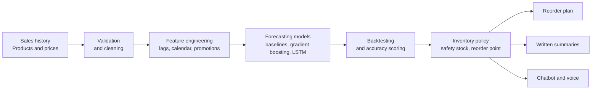

# StockSense AI

**Know what will sell. Order exactly that.**

An AI solution that turns a retailer's own sales history into demand forecasts
and practical reorder decisions.

> **Where the project is right now.** This repository holds the project
> definition, the documentation and the team's working process. The
> implementation is being built against the roadmap further down. Live progress
> is on the [project board](https://github.com/orgs/VUT-AI-SOLUTIONS-2026/projects).

## The problem

Independent supermarkets, spaza shops and township franchise stores order stock on instinct. A manager looks at the shelf, makes an estimate, and phones the supplier.

That estimate is usually wrong in one of two expensive directions.

| Ordering too much | Ordering too little |
| --- | --- |
| Cash sits in stock that is not moving | Empty shelves on the days demand is highest |
| Perishables get thrown away | The sale goes to the shop down the road |
| Storage fills up with slow movers | Customers stop coming back |

Large retail chains solve this with demand planning software that costs more per month than a small shop earns. So the small retailer keeps guessing, and keeps paying for the guess. That gap is where this project sits.

## What StockSense AI does

The solution needs only what a retailer already has: sales history, a product list and prices. From that it produces a replenishment plan.

| Capability | What the retailer sees |
| --- | --- |
| Demand forecasting | Predicted units per product, per store, per day, with a confidence range instead of one fragile number |
| Seasonality detection | The pay cycle spikes, month end peaks, public holidays and school terms that actually drive South African retail |
| Inventory optimisation | A recommended safety stock level and reorder point for every product, set to a chosen service level |
| Reorder alerts | What to order, how much, and when, before the shelf runs empty |
| Plain language insights | A short written summary of what changed and why, so a manager who is not an analyst can use it |
| Conversational assistant | Questions like "what should I reorder for the Vanderbijlpark store this week?" answered in text or by voice |

## How it will work

A forecast only gets trusted once it has earned it. Every model is scored against a simple baseline using rolling origin backtests, and a model is only adopted if it clearly beats the guess it replaces.

## Planned technology

| Layer | Tools |
| --- | --- |
| Language | Python 3.11 or later |
| Data handling | pandas, NumPy |
| Classical models | scikit-learn, statsmodels |
| Deep learning | TensorFlow and Keras, using an LSTM for sequential demand |
| Natural language | Intent recognition, written summary generation, speech input and output |
| Interface | FastAPI service, Streamlit dashboard, conversational assistant |
| Engineering | GitHub Actions, Ruff, pytest, pre-commit |

## The team

Ten members, which is the maximum the brief allows. Fill in your own row when you start.

| # | GitHub | Full name | Student number | Main responsibility |
| --- | --- | --- | --- | --- |
| 1 | [@morrissambo18-oss](https://github.com/morrissambo18-oss) | Morris Sambo |240699874| Project lead/ AI Engineer |
| 2 | [@junior07-oss](https://github.com/junior07-oss) |Percy Mduduzi Jr Dlamini |224057855 |AI Data Analyst |
| 3 | [@Kimzo-2](https://github.com/Kimzo-2) |write your full names here | add your student number here |role in the project |
| 4 | [@mazii14](https://github.com/mazii14) |Wandile Samuel Mazibuko |224067737 |Data Analyst |
| 5 | [@Mick92-r](https://github.com/Mick92-r) |Mick Ndaj Kongal |224342924 | Data Engineer / Data Collector |
| 6 | [@NeoMokoena2214](https://github.com/NeoMokoena2214) |write your full names here |add your student number here |role in the project |
| 7 | [@refiloemdluli75](https://github.com/refiloemdluli75) |write your full names here |add your student number here |role in the project |
| 8 | [@SenamileNhlanhla](https://github.com/SenamileNhlanhla) |write your full names here |add your student number here |role in the project |
| 9 | [@SiboM2](https://github.com/SiboM2) |Sibongiseni John Mokobori |224133209 |Frontend/Dashboard developer |
| 10 | [@zamajobe237](https://github.com/zamajobe237) |Zama Angel Mtetwa |225039907 |Documentation/ Business Analyst |

## How we work

All of our work is tracked on GitHub, which the brief requires. Every task is an issue on the [project board](https://github.com/orgs/VUT-AI-SOLUTIONS-2026/projects), every issue has an owner, and nothing goes into `main` without a pull request and a review from someone else in the group.

If you are about to make your first commit, read [CONTRIBUTING.md](CONTRIBUTING.md) first. It covers branch names, commit messages and how reviews work.

* [Report a bug](../../issues/new/choose)
* [Request a feature](../../issues/new/choose)
* [Contribution guide](CONTRIBUTING.md)
* [Code of conduct](CODE_OF_CONDUCT.md)
* [Security and data rules](SECURITY.md)

## Key dates

| Date | What happens |
| --- | --- |
| 10 August 2026 | Project issued |
| 2 November 2026, 23:59 | Documentation and presentation due on Blackboard. One submission only, and late work is not accepted |
| 9 to 13 November 2026 | First opportunity presentations, on campus |

Keep your own backup of everything. The brief is explicit that lost laptops are not an excuse, and this repository plus OneDrive or Google Drive covers you.

## About this project

StockSense AI is the capstone project of VUT AI Solutions, a group of ten students in the Diploma: Information Technology programme at the Vaal University of Technology.

It is submitted for Business Analysis 3.2, subject code AIBUY3A, under the theme "An AI Solution for Industries".

## Licence

Released under the [MIT Licence](LICENSE).
