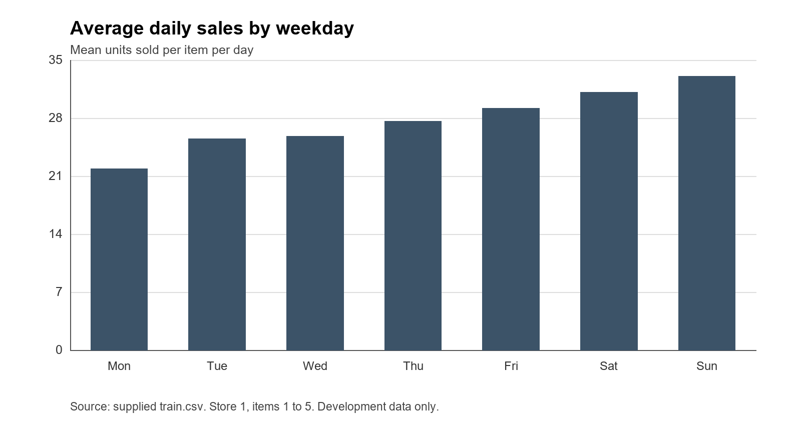

# StockSense AI

## Retail sales forecasting and stock replenishment

Vaal University of Technology

Diploma in Information Technology

Business Analysis 3 Module 2

Subject code AIBUY3A

Group VUT AI Solutions

Theme An AI Solution for Industries

Submission date 2 November 2026

## Project overview

We propose a Python application that forecasts sales and helps a small retailer plan stock orders. Our case study is fictional. We use historical Kaggle sales for one store and five items, together with clearly labelled stock and supplier assumptions. The application will show a seven-day forecast, a suggested order quantity and a short explanation. This report contains the business case, verified data findings and the proposed implementation and evaluation methods. Model comparisons, application screenshots and user tests will be added after the prototype is built. Benefits such as lower costs or fewer shortages remain objectives to evaluate.

<!-- PAGE -->

## Declaration and group members

We declare that the submitted project is our own work and that we have referenced the work and ideas of others where used. Each member must review and sign this declaration before submission. The signature spaces below are intentionally blank.

| Full name | Student number | Signature | Date |
| --- | --- | --- | --- |
| Morris Sambo | 240699874 | | |
| Percy Mduduzi Jr Dlamini | 224057855 | | |
| Ungakimi Nkambule | 222072385 | | |
| Wandile Samuel Mazibuko | 224067737 | | |
| Mick Ndaj Kongal | 224342924 | | |
| Neo Mokoena | 240111699 | | |
| Buhle Refiloe Mdluli | 224661612 | | |
| Senamile Nhlanhla | 224110519 | | |
| Sibongiseni John Mokobori | 224133209 | | |
| Zama Angel Mtetwa | 225039907 | | |

<!-- PAGE -->

## 1 Background and theme relevance

StockSense AI is a proposed Python application that uses historical sales to help a retailer plan stock purchases. We use a fictional small retailer as the business case and Kaggle's Store Item Demand Forecasting dataset for demonstration [1]. The prototype will cover store 1 and items 1 to 5, predict the next seven days of sales and suggest order quantities using stock and delivery inputs. It fits the theme An AI Solution for Industries by applying machine learning to a retail business decision. The intended benefit is to give the manager a consistent estimate of upcoming sales before placing an order. A small dashboard and text assistant will make the estimates and their assumptions easy to retrieve. The approach illustrates how accessible Python tools can support stock planning in a small retail setting, although the historical data is not evidence of performance in a South African shop.

## 2 Problem definition

### The problem

In our fictional retail case, the manager decides how much stock to order by checking current stock and recent sales. The process does not use a consistent forecast for the period ahead. If the manager underestimates sales, products may run out before the next delivery. If the manager overestimates sales, money is tied up in stock that sells slowly. The manager needs a simple way to estimate upcoming sales and compare those estimates with available stock before placing an order. This case study assumption defines the business problem. The selected dataset provides historical sales for testing forecasts, but does not establish that a particular South African retailer experiences this problem.

### The benefit of solving it

StockSense AI will produce seven-day sales estimates and demonstration order suggestions. This supports the retail industry by applying AI to stock planning. The intended benefits are more consistent ordering and clearer information for the manager. Forecast accuracy will be tested on historical data. Reductions in stockouts, waste or costs would require a separate inventory simulation or business trial before they could be claimed as achieved results.

## 3 Business analysis

### 3.1 Business background and current process

The case represents a small retailer that records sales each day and orders goods from a supplier. The store and item numbers remain anonymous IDs. We do not assign actual locations or product names to them because the dataset does not provide these details.

The assumed current process is to review recent sales, check stock available and choose an order quantity manually. In the proposed process, the manager opens the application, selects an item and checks its sales history and seven-day forecast. The manager enters stock and delivery information, then reviews the suggested quantity and its calculation. Ordering remains a business decision made by the manager.

### 3.2 Main objective

Our main objective is to develop a Python prototype that forecasts sales for five items at one store and uses those forecasts to support stock planning. We will compare the forecasts with a simple baseline and demonstrate the recommendations in a small dashboard.

### 3.3 Business objectives and success criteria

The following criteria are proposed acceptance targets. Their achieved results will be recorded during prototype testing.

| Objective | How it will be assessed |
| --- | --- |
| Provide a consistent sales estimate | Produce seven daily estimates for each of the five selected items and identify the forecast dates. |
| Improve on a simple forecasting rule | Compare the selected model's mean absolute error with a weekly seasonal naive baseline on identical test dates. |
| Support stock ordering | Calculate non-negative whole-unit suggestions from stated stock and delivery inputs. Verify the arithmetic with at least 10 input cases. |
| Make recommendations understandable | Ask three reviewers to identify the forecast, stock input and reason for the recommendation. Each should answer at least four of five prepared questions correctly. |
| Keep the application practical | Aim to display saved-model forecasts within 10 seconds on the demonstration laptop. Record the observed time. |

Fewer stockouts and less unnecessary stock are longer-term business objectives. Our sales dataset alone cannot measure those outcomes because it contains no inventory balances, delivery records or costs. We will report forecast accuracy separately from business impact.

### 3.4 Requirements

The system must load the sales CSV, check its required columns and organise records by store, item and date. It must let the manager choose from items 1 to 5 at store 1, show recent sales and produce a seven-day forecast. Stock inputs must lead to a visible order suggestion and explanation. The text assistant must retrieve the same calculated information shown in the dashboard.

The application must reject negative quantities, unknown item IDs and unsupported delivery horizons. It must explain when insufficient history prevents a forecast. Saved models and demonstration files should allow it to run without a paid cloud service. The forecast cut-off date must remain visible so that a historical demonstration is not mistaken for a live forecast.

All sales, stock and order quantities will be expressed in units. We will use Python for the application and GitHub Projects to assign and track work. Each report section will have a writer and another member who reviews it.

### 3.5 Constraints

Our scope is one store, five items and a seven-day forecast. We will not connect the prototype to a till system or place supplier orders. The data covers 2013 to 2017, so the demonstration is historical. Kaggle's description notes that there are no holiday effects or store closures [1]. We will not claim that the data measures South African holidays, pay cycles or load shedding.

Stock levels, outstanding orders, supplier lead times and the buffer stock quantity are demonstration inputs. Prices and purchase costs are absent, which prevents a financial savings calculation. The available laptop and submission deadline also limit the size of the model comparison.

### 3.6 Risks and responses

| Risk | Response |
| --- | --- |
| Future sales enter the training features | Build each sample from information available at its forecast date. Keep all seven target dates inside the assigned training period. |
| A complex model performs poorly | Compare every candidate with the same simple baseline and retain the more reliable method for the demonstration. |
| A stock recommendation is treated as a guarantee | Display its inputs and assumptions. Flag possible shortages before delivery and explain that uncertain sales can differ from the forecast. |
| The demonstration fails on another laptop | Save dependencies and model files, rehearse on another machine and keep a backup recording. |
| Report sections disagree | Use the same scope and data splits throughout and review the complete report together. |

### 3.7 Tools and techniques

Python and pandas will prepare the sales records. scikit-learn will provide the random forest and text classification tools. Keras will support a small LSTM experiment. Streamlit will display the forecast, stock inputs and text assistant in one application. These are proposed choices; the implementation record will include the actual package versions used.

The initial model comparison is limited to a seasonal naive baseline, random forest regression and a small LSTM. The baseline is easy to explain. Random forest can use recent sales and calendar features, while the LSTM provides a sequence-based deep learning comparison. A simple interface and limited text assistant keep the scope within what the group can build and explain.

## 4 Machine learning approach

### 4.1 Prediction task

This is supervised regression. Historical sales are the known outcomes, and the model will estimate the next seven daily quantities. Sales are observed purchases, so they may differ from unmet customer demand when stock is unavailable.

At each forecast cut-off, the model will use the preceding 28 days of sales. Features for the random forest will include those past quantities, seven-day and 28-day averages, and the weekday and month of each target date. Dates are known in advance. Future sales will never be used to construct features.

### 4.2 Candidate methods

The seasonal naive baseline repeats the most recent week's sales on the matching weekdays. This is a standard benchmark for seasonal series [3]. It makes the comparison meaningful: the AI model should be tested against a rule the retailer could already apply.

The proposed random forest will use one model per item, with seven outputs representing the next seven days. A forest combines predictions from multiple decision trees [4]. Our starting settings are 100 trees, maximum depth 10, minimum leaf size 3 and random seed 42. Limited alternatives will be compared on validation data before the final settings are fixed.

The small LSTM will use the same forecast horizon and cut-off dates. It is included to test whether sequence modelling adds value for these items. We will report its error and training time even if a simpler method is chosen for the dashboard.

Linear regression was considered as an interpretable alternative, but may need carefully designed features to capture changing seasonal relationships. A large neural network is unnecessary for five short daily series. These are design judgements to revisit if the validation results suggest otherwise.

## 5 Data

### 5.1 Source and verified structure

The supplied Kaggle archive contains train.csv, test.csv and sample_submission.csv. We inspected train.csv directly on 9 October 2026. It contains 913,000 rows and four columns, covering 1 January 2013 to 31 December 2017. There are 10 stores and 50 items, giving 500 store and item series. Each series has 1,826 daily records.

| Field | Meaning | Use in the project |
| --- | --- | --- |
| date | Day of the sales record | Sort history and derive calendar features. |
| store | Anonymous store ID | Select store 1. |
| item | Anonymous item ID | Select items 1 to 5. |
| sales | Number of units sold that day | Historical input and prediction target. |

The chosen subset contains 9,130 records. The five items have different average sales levels, which lets us check whether a method works consistently across items rather than showing only one favourable example.

### 5.2 Actual sample records

These are the first five source records for store 1 and item 1.

| date | store | item | sales |
| --- | --- | --- | --- |
| 2013-01-01 | 1 | 1 | 13 |
| 2013-01-02 | 1 | 1 | 11 |
| 2013-01-03 | 1 | 1 | 14 |
| 2013-01-04 | 1 | 1 | 13 |
| 2013-01-05 | 1 | 1 | 10 |

### 5.3 Data quality checks and preparation

We found no missing cells, duplicate rows, repeated date-store-item keys or negative sales. Quantities range from 0 to 231. The complete source has one zero-sales record. Every store and item pair has a complete daily history over the same date range.

Preparation will preserve the original file, select the five series and sort each by date. The first 28 days of each series provide history rather than complete training samples. Training windows will be removed whenever any of their seven target dates fall outside the training period. We will record the resulting sample counts when the pipeline is implemented.

Zero sales is a valid quantity and will not be converted into missing data. High sales will be reviewed before any removal because they may be legitimate observations. If later input files contain missing days, the application will flag them rather than silently treat them as zero demand.

### 5.4 Other data used by the application

Stock data will be entered manually for the demonstration. An illustrative record is item 1, 20 units available, 5 units already ordered, supplier lead time 3 days, review interval 1 day and buffer stock 10 units. These values are assumptions, not Kaggle observations.

The assistant's training data will consist of short questions written and labelled by the group. For example, "How much will item 2 sell next week?" has the label forecast. This is unstructured text linked to a structured intent label. The resulting answer will retrieve the relevant forecast rather than invent a number.

Output records will contain the item ID, forecast date, predicted quantity and selected model. Recommendation records will include the stock inputs and calculated order quantity. These are derived application outputs. We will document them separately from the original sales records.

The source contains anonymous IDs rather than customer details. We will use those IDs for this project and follow the dataset's competition terms. The raw CSV will remain separate from report drafts and application source code.

## 6 Model evaluation and time series analysis

### 6.1 Chronological evaluation plan

We will reserve later dates for validation and testing rather than shuffle the observations. This reproduces the forecasting task, where future sales are unavailable at the time a forecast is made.

| Period | Dates | Raw records for five items |
| --- | --- | --- |
| Training | 2013-01-01 to 2015-12-31 | 5,475 |
| Validation | 2016-01-01 to 2016-12-31 | 1,830 |
| Test | 2017-01-01 to 2017-12-31 | 1,825 |

These counts describe raw daily observations, not the number of training windows. Validation will be used to select features and model settings. After selection, we will refit using data through 31 December 2016. We will then evaluate fixed models on seven-day forecasts in 2017. Forecast origins move forward seven days, and each origin can use sales observed before it. No actual sales from within its forecast week will be used. The final incomplete week will be excluded consistently and its dates documented.

The separate Kaggle test.csv has 45,000 rows for 1 January to 31 March 2018 and no sales column. sample_submission.csv is a submission template, not actual sales. We will therefore evaluate locally using the held-out 2017 observations in train.csv.

### 6.2 Accuracy measures

Mean absolute error is the average absolute difference between forecast and actual sales, measured in units [5]. Root mean squared error also uses units but gives greater weight to large errors. We will report both by item and across all scored forecasts. A percentage improvement over baseline MAE can be calculated as 100 times the baseline error minus the model error, divided by the baseline error, provided the baseline error is greater than zero.

The evaluation will also check seven-day total errors, because the order calculation depends on quantities across several days. Models will use identical target dates. If negative forecasts occur, a zero lower bound will be part of the defined output rule and evaluation will score those same bounded values. Forecasts will remain decimals for error measurement; order quantities will be rounded upwards to whole units.

### 6.3 Observed time series patterns

The following charts use store 1 and items 1 to 5 from 2013 through 2016. We have left 2017 out of the descriptive charts used to design the models.

Figure 1. Monthly total units for store 1 and items 1 to 5, using development data only.

Total annual sales for these items rise from 43,208 units in 2013 to 56,943 in 2016. The monthly chart also shows repeated rises and falls across the years. We will use calendar features and recent sales levels to represent these patterns. The chart describes the data; it does not establish the cause of the changes.

Figure 2. Mean units sold per item per day, grouped by weekday, for 2013 through 2016.

The mean is 21.88 units on Mondays and 33.01 on Sundays for this subset. This supports using a weekly seasonal baseline and weekday features. The figures combine five items, so we will also review item-level errors rather than assume that each item follows the same pattern.

### 6.4 Results to add after implementation

No forecasting models have been trained for this report. The final comparison will record each method's MAE, RMSE, seven-day total error and training time. It will identify the selected method and explain any items for which it failed to beat the baseline. This section must be completed with measured results before the final submission.

## 7 Solution techniques

### 7.1 Improving forecast performance

We will compare calendar features and recent sales summaries on validation data. For random forest, we will test a small number of tree-depth and minimum-leaf settings. For LSTM, validation error will guide the training stopping point. The final test year will be used once the choices are fixed.

Error analysis will compare items, weekdays and forecast horizons. An error concentrated on a particular item may require a different method for that item. We will record changes and their validation results rather than tune repeatedly on the final test data. Retraining with new records is a future operational step that would need the same checks before replacing a working model.

### 7.2 Stock recommendation rule

The demonstration uses a simple periodic review rule. Its inputs are supplier lead time L, review interval R, stock available S, outstanding units O due within the coverage period and a fixed buffer B. We limit L plus R to seven days. Outstanding orders are assumed to arrive before they are needed in this simplified calculation.

The target stock is the sum of predicted sales over the next L plus R days, plus B. Inventory position is S plus O. The suggested order is the positive difference between target stock and inventory position, rounded upwards. If inventory position exceeds the target, the suggested order is zero. This is a transparent planning rule rather than an optimised inventory policy.

For an illustrative forecast of 10 units per day, a three-day lead time and one-day review interval give expected sales of 40 units over the coverage period. A buffer of 10 gives target stock of 50. If stock available is 20 and outstanding orders total 5, the order suggestion is 25 units. These values demonstrate the arithmetic and are not model results.

The interface will flag a possible shortage before delivery when forecast sales during the lead time exceed available stock and arrivals due by then. An order placed today cannot automatically resolve a shortage before the supplier arrives. We will state the simplified arrival assumptions with the recommendation.

### 7.3 Difficult cases

An unknown item or one with less than 28 days of history will trigger an explanation instead of an unsupported model forecast. Invalid stock quantities will be rejected. A product with sparse sales may need a different baseline, although the selected subset will first be assessed through the common comparison. Sales without inventory information cannot reveal lost demand during stockouts, and this remains a limitation.

## 8 Natural language processing

The proposed language feature is an English text assistant. It will recognise five request types: forecast, reorder suggestion, sales history, model performance and help. Voice input and multilingual support are outside this prototype's scope.

We will prepare labelled examples for each request type. TF-IDF will turn the words into numerical features [6], and a small classification model will assign the request type. A separate check will extract the item number and confirm that it is supported. The application will then retrieve the appropriate figures and format a short answer.

Training, validation and test questions will contain different phrasings. We will record classification accuracy and errors by request type. A proposed acceptance target is at least 20 correct classifications out of 25 held-out in-scope questions. Additional unsupported questions will test whether the assistant asks for clarification or shows its help options. A confidence threshold, if used, will be chosen on validation questions rather than assumed to be a reliable probability of correctness.

## 9 Deep learning

The proposed LSTM comparison will learn from sequences of past daily sales. LSTM layers process ordered inputs and maintain a state across a sequence [7]. We will use one small model per item to avoid combining the five sales levels without a clear treatment.

Each input contains 28 days of sales and corresponding calendar features. A 16-unit LSTM feeds a dense output layer with seven sales estimates. We propose mean squared error as the training loss, the Adam optimiser and batches of 32. Training will run for at most 50 epochs. These are starting settings to verify during implementation.

Scaling parameters will be fitted only on the training period and then applied unchanged to later data. Sales predictions will be converted back to original units before evaluation. Early stopping will monitor validation loss, with patience of five epochs and restoration of the best weights [8]. The small network and early stopping limit unnecessary fitting. We will compare validation and training loss to check for overfitting.

After validation, the final training duration will be fixed before refitting through 2016. We will compare the LSTM with the baseline and random forest on the same 2017 weeks. Its use in the main application will depend on that comparison, not on the assumption that deep learning is always better.

## 10 Chatbot design

The chatbot will use the language classifier described above and the application's stored outputs. For example, "Show next week's sales for item 2" will return seven dated estimates and their total. "What should I order for item 3?" will return the suggestion using the stock inputs entered for item 3. If those inputs are absent, the assistant will ask the user to provide them.

The assistant will not answer questions about prices, supplier names, weather or unsupported items. An unclear request will receive a clarification question or a list of supported requests. Its displayed quantities must match the dashboard. Tests will compare the response with the underlying output record, including missing inputs and invalid IDs.

## 11 Practical solution and demonstration

The proposed demonstration starts with loading the prepared data and selecting an item. It shows the recent sales chart, seven-day forecast and comparison method. The presenter then changes stock inputs and explains how the suggested order changes. Finally, the presenter asks the assistant for the same forecast and demonstrates an unsupported question.

The prototype must run on another group member's laptop before presentation. We will save the model files, data preparation instructions and package versions needed to repeat it. A backup recording and copies of the slides will be kept for presentation problems. Screenshots, test outcomes and the actual demonstration sequence will be added after implementation.

The digital poster will summarise the problem, solution, data flow, features and measured findings. The presentation will use the assignment's 20-minute limit, followed by five minutes of questions. All members will review the whole report and prepare to explain the choices behind the solution.

## 12 Conclusion

The data inspection supports a focused forecasting prototype using one store and five items. The selected records are complete, and the development data shows weekly and longer-term changes that can be examined with simple forecasting methods. Our next step is to implement the planned comparison and stock recommendation rule. The final conclusion will use the measured results to state what the solution achieved and where further testing is needed.

## References

[1] Kaggle. Store Item Demand Forecasting Challenge. Data description. https://www.kaggle.com/competitions/demand-forecasting-kernels-only/data. Accessed 9 October 2026. The group supplied the associated archive; numerical data findings and Figures 1 and 2 were calculated directly from its train.csv.

[2] Kaggle. Store Item Demand Forecasting Challenge. Overview. https://www.kaggle.com/c/demand-forecasting-kernels-only/overview. Accessed 9 October 2026.

[3] Hyndman, R. J. and Athanasopoulos, G. Forecasting Principles and Practice, third edition. Some simple forecasting methods. https://otexts.com/fpp3/simple-methods.html. Accessed 9 October 2026.

[4] scikit-learn. RandomForestRegressor documentation. https://scikit-learn.org/stable/modules/generated/sklearn.ensemble.RandomForestRegressor.html. Accessed 9 October 2026.

[5] scikit-learn. mean_absolute_error documentation. https://scikit-learn.org/stable/modules/generated/sklearn.metrics.mean_absolute_error.html. Accessed 9 October 2026.

[6] scikit-learn. TfidfVectorizer documentation. https://scikit-learn.org/stable/modules/generated/sklearn.feature_extraction.text.TfidfVectorizer.html. Accessed 9 October 2026.

[7] Keras. LSTM layer documentation. https://keras.io/api/layers/recurrent_layers/lstm/. Accessed 9 October 2026.

[8] Keras. EarlyStopping documentation. https://keras.io/api/callbacks/early_stopping/. Accessed 9 October 2026.

## Appendix A Evidence required before submission

Add the completed model comparison, selected model settings, screenshots and application test results. Record the language classifier evaluation and the recommendation arithmetic checks. Explain any changes from the proposed design.

All members must sign the declaration. Attach the Grammarly certificate or results, finish the digital poster and presentation, then export and inspect the final PDF using Arial 12, line spacing 1.5 and justified body text. Confirm that the figures and tables are readable before uploading to Blackboard.
