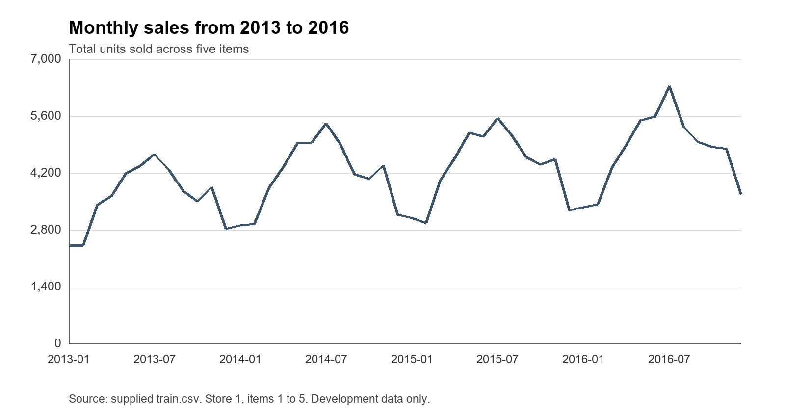
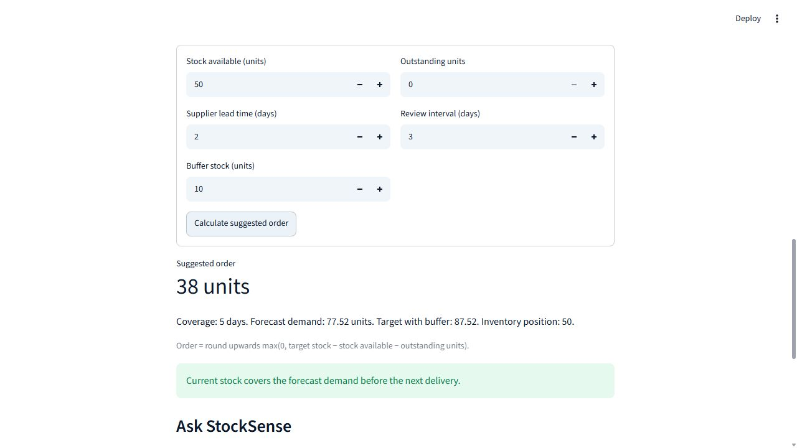

# StockSense AI

## Retail sales forecasting and stock replenishment

Vaal University of Technology

Diploma in Information Technology

Business Analysis 3 Module 2

Subject code AIBUY3A

Group VUT AI Solutions

Theme An AI Solution for Industries

Submission date 2 November 2026

## Project overview

StockSense AI is a local Python application for sales forecasting and demonstration stock planning. Our fictional retailer uses anonymous store 1 and items 1 to 5 from Kaggle. We compared a weekly benchmark, random forest and a small LSTM using chronological data splits. Random forest achieved the lowest daily validation error and remains selected after final testing. The application shows seven dated estimates, a transparent stock calculation and a five-intent text assistant. This report records the implemented scope and measured evidence. Real cost savings and stockout reductions require a separate business trial. Group review, signed declarations and Grammarly evidence remain required before submission.

<!-- PAGE -->

## Declaration and group members

We declare that the submitted project is our own work and that we have referenced the work and ideas of others where used. Each member must review and sign this declaration before submission. The signature spaces below are intentionally blank.

| Full name | Student number | Signature | Date |
| --- | --- | --- | --- |
| Morris Sambo | 240699874 | | |
| Percy Mduduzi Jr Dlamini | 224057855 | | |
| Ungakimi Nkambule | 222072385 | | |
| Wandile Samuel Mazibuko | 224067737 | | |
| Mick Ndaj Kongal | 224342924 | | |
| Neo Mokoena | 240111699 | | |
| Buhle Refiloe Mdluli | 224661612 | | |
| Senamile Nhlanhla | 224110519 | | |
| Sibongiseni John Mokobori | 224133209 | | |
| Zama Angel Mtetwa | 225039907 | | |

<!-- PAGE -->

## 1 Background and theme relevance

StockSense AI uses historical sales to help a fictional retailer plan stock purchases. Kaggle's Store Item Demand Forecasting dataset supplies anonymous sales records [1]. The Python prototype covers store 1 and items 1 to 5, predicts seven daily quantities and calculates order suggestions using entered stock and delivery assumptions. It fits the theme An AI Solution for Industries by applying machine learning to a retail decision. The intended benefit is a consistent estimate before ordering. A local dashboard and text assistant make the estimates and assumptions accessible. The historical demonstration does not establish business performance in a South African shop.

## 2 Problem definition

### The problem

In our fictional retail case, the manager decides how much stock to order by checking current stock and recent sales. The process does not use a consistent forecast for the period ahead. If the manager underestimates sales, products may run out before the next delivery. If the manager overestimates sales, money is tied up in stock that sells slowly. The manager needs a simple way to estimate upcoming sales and compare those estimates with available stock before placing an order. This case study assumption defines the business problem. The selected dataset provides historical sales for testing forecasts, but does not establish that a particular South African retailer experiences this problem.

### The benefit of solving it

StockSense AI produces seven-day sales estimates and demonstration order suggestions. This supports the retail industry by applying AI to stock planning. The intended benefits are more consistent ordering and clearer information for the manager. Forecast accuracy was tested on historical data. Reductions in stockouts, waste or costs would require a separate inventory simulation or business trial before they could be claimed as achieved results.

## 3 Business analysis

### 3.1 Business background and current process

The case represents a small retailer that records sales each day and orders goods from a supplier. The store and item numbers remain anonymous IDs. We do not assign actual locations or product names to them because the dataset does not provide these details.

The assumed current process is to review recent sales, check stock available and choose an order quantity manually. In the proposed process, the manager opens the application, selects an item and checks its sales history and seven-day forecast. The manager enters stock and delivery information, then reviews the suggested quantity and its calculation. Ordering remains a business decision made by the manager.

### 3.2 Main objective

Develop a small Python application that forecasts seven days of sales for five items and uses those estimates to support understandable stock decisions. Compare the learned models with a weekly benchmark and retain a simple local demonstration that every member can explain.

### 3.3 Business objectives and success criteria

| Objective | Acceptance criterion | Evidence and status |
| --- | --- | --- |
| Consistent estimate | Seven dated values for all five items | Passed on this PC; 45 tests include five-item dashboard checks. |
| Lower daily forecast error | Beat weekly benchmark on identical dates | Random forest final MAE 4.812 versus 6.273 units, about 23.3% lower. |
| Transparent stock suggestion | At least ten arithmetic cases and invalid inputs | Automated calculation cases and dashboard checks passed. |
| Understandable interface | Three reviewers each answer four of five questions correctly | Human usability review pending; no reviewer outcomes claimed. |
| Practical local response | Saved forecasts displayed within ten seconds | AppTest initial render 7.29 seconds; warm selections 0.20-0.23 seconds. Browser latency and human timing remain separate. |
| Useful text requests | At least 20 of 25 supported intents recognised | Saved fresh evaluation: 24/25, plus 8/8 unrelated requests rejected. |

Lower waste, fewer stockouts and lower costs remain business objectives. The sales dataset has no inventory balances, delivery records or prices, so this prototype cannot establish those benefits.

### 3.4 Requirements

The system must load the sales CSV, check its required columns and organise records by store, item and date. It must let the manager choose from items 1 to 5 at store 1, show recent sales and produce a seven-day forecast. Stock inputs must lead to a visible order suggestion and explanation. The text assistant must retrieve the same calculated information shown in the dashboard.

The application must reject negative quantities, unknown item IDs and unsupported delivery horizons. It must explain when insufficient history prevents a forecast. Saved models and demonstration files should allow it to run without a paid cloud service. The forecast cut-off date must remain visible so that a historical demonstration is not mistaken for a live forecast.

All sales, stock and order quantities will be expressed in units. We will use Python for the application and GitHub Projects to assign and track work. Each report section will have a writer and another member who reviews it.

### 3.5 Constraints

Our scope is one store, five items and a seven-day forecast. We will not connect the prototype to a till system or place supplier orders. The data covers 2013 to 2017, so the demonstration is historical. Kaggle's description notes that there are no holiday effects or store closures [1]. We will not claim that the data measures South African holidays, pay cycles or load shedding.

Stock levels, outstanding orders, supplier lead times and the buffer stock quantity are demonstration inputs. Prices and purchase costs are absent, which prevents a financial savings calculation. The available laptop and submission deadline also limit the size of the model comparison.

### 3.6 Risks and responses

| Risk | Response |
| --- | --- |
| Future sales enter the training features | Build each sample from information available at its forecast date. Keep all seven target dates inside the assigned training period. |
| A complex model performs poorly | Compare every candidate with the same simple baseline and retain the more reliable method for the demonstration. |
| A stock recommendation is treated as a guarantee | Display its inputs and assumptions. Flag possible shortages before delivery and explain that uncertain sales can differ from the forecast. |
| The demonstration fails on another laptop | Save dependencies and model files, rehearse on another machine and keep a backup recording. |
| Report sections disagree | Use the same scope and data splits throughout and review the complete report together. |

### 3.7 Tools and techniques

Python and pandas validate and prepare the sales records. scikit-learn supplies random forest regression and text classification. Keras with a local PyTorch backend supplies the small LSTM comparison. Streamlit combines the history, forecast, stock form and assistant on one page. Scripts train models separately, and the dashboard loads saved files. No paid online language service is required.

The weekly benchmark is easy to explain. Random forest uses recent sales and known calendar information. LSTM provides a small sequence experiment and a measured deep-learning comparison. A single page and five request types keep the solution within the group's explainable scope. Git stores source and reviewed documentation; raw data, the environment and trained models remain local. GitHub issues #23-31 and #41 retain the existing owners. Their human reviews remain open. The Projects board could not be verified on this PC because the current CLI credential lacks read:project permission.

## 4 Machine learning approach

### 4.1 Prediction task

This is supervised regression: observed daily sales are the targets, and each model predicts seven quantities. Sales can understate demand when inventory is unavailable. The dataset has no stockout information, so we forecast recorded sales rather than claim unconstrained demand.

Random forest inputs are 28 sales lags, 7-, 14- and 28-day means, and sine/cosine encodings of each target date's weekday and annual position. Dates are known at the cut-off; target sales are excluded from inputs. Every fitting window keeps all seven target days inside the training boundary.

### 4.2 Compared methods

The weekly seasonal naive benchmark repeats the last observed week's sales on matching weekdays [3]. One random forest per item predicts seven outputs with 100 trees, depth 10, minimum leaf size 3, seed 42 and one worker [4]. These fixed settings are the implemented comparison; no tree-depth search was performed. One small LSTM per item uses 28 chronological sales inputs and seven outputs, without calendar inputs.

The predefined criterion is overall daily 2016 validation MAE, with simpler methods retained on ties. Random forest won this criterion. Selection-lock.json froze the method, dataset checksum, settings and epoch counts before 2017 scoring. The LSTM's stronger weekly-total result is reported rather than changing the criterion afterwards. Linear regression was considered earlier but was not part of the completed measured comparison.

## 5 Data

### 5.1 Source and verified structure

The supplied Kaggle archive contains train.csv, test.csv and sample_submission.csv. The office inspection on 9 October 2026 was independently reproduced on this personal PC on 10 October 2026. It contains 913,000 rows and four columns, covering 1 January 2013 to 31 December 2017. There are 10 stores and 50 items, giving 500 store and item series. Each series has 1,826 daily records.

| Field | Meaning | Use in the project |
| --- | --- | --- |
| date | Day of the sales record | Sort history and derive calendar features. |
| store | Anonymous store ID | Select store 1. |
| item | Anonymous item ID | Select items 1 to 5. |
| sales | Number of units sold that day | Historical input and prediction target. |

The chosen subset contains 9,130 records. The five items have different average sales levels, which lets us check whether a method works consistently across items rather than showing only one favourable example.

### 5.2 Actual sample records

These are the first five source records for store 1 and item 1.

| date | store | item | sales |
| --- | --- | --- | --- |
| 2013-01-01 | 1 | 1 | 13 |
| 2013-01-02 | 1 | 1 | 11 |
| 2013-01-03 | 1 | 1 | 14 |
| 2013-01-04 | 1 | 1 | 13 |
| 2013-01-05 | 1 | 1 | 10 |

### 5.3 Data quality checks and preparation

We found no missing cells, duplicate rows, repeated date-store-item keys or negative sales. Quantities range from 0 to 231. The complete source has one zero-sales record. Every store and item pair has a complete daily history over the same date range.

Preparation preserves train.csv, selects the five series and sorts by date. Checks reject missing columns, invalid dates, duplicate daily keys, missing days and negative or fractional quantities. Zero sales remains a valid value. No missing day is silently converted to zero. Each item has 1,061 initial fitting windows and 1,427 final refit windows.

Raw and prepared SHA-256 checksums match the office record. The complete values are recorded in the personal-PC rehearsal and local data audit. Checksums identify the files used without placing raw data in Git.

### 5.4 Other data used by the application

Stock data is entered manually for the demonstration. An illustrative record is item 1, 20 units available, 5 units already ordered, supplier lead time 3 days, review interval 1 day and buffer stock 10 units. These values are assumptions, not Kaggle observations.

The assistant's training corpus contains short labelled English examples. Independent member questions and review remain pending. For example, "How much will item 2 sell next week?" has the label forecast. This is unstructured text linked to a structured intent label. The resulting answer retrieves the relevant forecast rather than invent a number.

Output records contain the item ID, forecast date, predicted quantity and selected model. Recommendation records include the stock inputs and calculated order quantity. These are derived application outputs. We document them separately from the original sales records.

The source contains anonymous IDs rather than customer details. We will use those IDs for this project and follow the dataset's competition terms. The raw CSV will remain separate from report drafts and application source code.

## 6 Model evaluation and time series analysis

### 6.1 Chronological evaluation

| Period | Raw records for five items | Role |
| --- | --- | --- |
| 2013-2015 | 5,475 | Initial fitting |
| 2016 | 1,830 | Validation and frozen selection |
| 2017 | 1,825 | Final evaluation |

Each evaluation uses 52 complete weeks per item: 364 daily predictions per item, 1,820 overall and 260 item-week totals. Validation scores 1 January to 29 December 2016 and excludes 30-31 December. Final testing scores 1 January to 30 December 2017 and excludes 31 December. All methods use the same dates.

Observed history advances between forecast weeks, while learned weights remain fixed. Each forecast sees sales only before its cut-off. Final models refit through 31 December 2016, with fixed validation-selected LSTM epochs and no early stopping on 2017. Save/reload checks ensure the scored models match persisted files. The separate Kaggle 2018 test.csv has no sales column and cannot supply local accuracy scores.

### 6.2 Error measures

Daily MAE averages absolute predicted-minus-observed errors in units [5]. RMSE weights larger errors more strongly. Weekly-total MAE compares each predicted and observed seven-day total. Predictions are clipped at zero and scored without rounding. Percentage error reduction equals 100 times (benchmark MAE minus selected MAE) divided by benchmark MAE. It is a relative reduction in error, not a percentage of accuracy. Stock order rounding happens only after the calculation.

### 6.3 Observed time series patterns

The following charts use store 1 and items 1 to 5 from 2013 through 2016. We have left 2017 out of the descriptive charts used to design the models.

Figure 1. Monthly total units for store 1 and items 1 to 5, using development data only.

Total annual sales for these items rise from 43,208 units in 2013 to 56,943 in 2016. The monthly chart also shows repeated rises and falls across the years. We use calendar features and recent sales levels to represent these patterns. The chart describes the data; it does not establish the cause of the changes.

Figure 2. Mean units sold per item per day, grouped by weekday, for 2013 through 2016.

The mean is 21.88 units on Mondays and 33.01 on Sundays for this subset. This supports using a weekly seasonal baseline and weekday features. The figures combine five items, so we also report item-level errors rather than assume that each item follows the same pattern.

### 6.4 Measured model comparison

2016 validation on this PC:

| Method | Daily MAE | Daily RMSE | Weekly-total MAE |
| --- | ---: | ---: | ---: |
| Weekly benchmark | 6.320 | 8.217 | 18.758 |
| Random forest | 4.911 | 6.596 | 19.797 |
| Small LSTM | 5.439 | 7.227 | 17.280 |

2017 final test on this PC:

| Method | Daily MAE | Daily RMSE | Weekly-total MAE |
| --- | ---: | ---: | ---: |
| Weekly benchmark | 6.273 | 8.218 | 18.427 |
| Random forest | 4.812 | 6.387 | 17.973 |
| Small LSTM | 5.411 | 7.261 | 17.343 |

The personal-PC metrics match the documented office results to three decimal places. Random forest has the lowest daily error for all five items and approximately 23.3% less overall final daily MAE than the benchmark. LSTM has the lowest overall weekly-total error in both periods. Random forest's weekly-total validation error is worse than the benchmark; its final weekly error is slightly better overall but worse for items 3 and 4. Daily selection therefore does not demonstrate optimal stock orders. The methods also receive different inputs, so this limited configuration comparison cannot establish general algorithm superiority.

The full per-item results are preserved in docs/final-model-results.md and local final-test.json. Models forecast 1-7 January 2018 in the dashboard using history through 31 December 2017. Actual outcomes are absent, and neither historical table measures those estimates' future accuracy.

## 7 Solution techniques

### 7.1 Performance and fair comparison

We used recent means and known calendar encodings for random forest, chronological sales sequences for LSTM, and validation loss to choose LSTM stopping epochs. The comparison kept one declared forest configuration and one small network architecture. Test-year data did not choose features, settings, scaling or model selection. Completed evaluation files are protected against accidental retraining.

Future improvements would require a new prospectively labelled experiment and new untouched evaluation data. Inventory simulation could compare order decisions using delivery, cost and stockout information. The current 2017 results must not become a tuning set. Human review can improve explanations without changing the frozen models.

### 7.2 Stock recommendation rule

The demonstration uses a simple periodic review rule. Its inputs are supplier lead time L, review interval R, stock available S, outstanding units O due within the coverage period and a fixed buffer B. We limit L plus R to seven days. Outstanding units and an order placed today arrive after the entered lead time. Lead time 2 means before forecast day 3; lead time 0 means before day 1. Outstanding units do not cover sales before that arrival.

The target stock is the sum of predicted sales over the next L plus R days, plus B. Inventory position is S plus O. The suggested order is the positive difference between target stock and inventory position, rounded upwards. If inventory position exceeds the target, the suggested order is zero. This is a transparent planning rule rather than an optimised inventory policy.

For an illustrative forecast of 10 units per day, a three-day lead time and one-day review interval give expected sales of 40 units over the coverage period. A buffer of 10 gives target stock of 50. If stock available is 20 and outstanding orders total 5, the order suggestion is 25 units. These values demonstrate the arithmetic and are not model results.

The interface flags a possible shortage before delivery when forecast sales before delivery exceed currently available stock. An order placed today cannot automatically resolve a shortage before the supplier arrives. We state the simplified arrival assumptions with the recommendation.

### 7.3 Difficult cases

An unknown item or one with less than 28 days of history triggers an explanation instead of an unsupported model forecast. Invalid stock quantities are rejected. A product with sparse sales may need a different baseline, although the selected subset will first be assessed through the common comparison. Sales without inventory information cannot reveal lost demand during stockouts, and this remains a limitation.

## 8 Natural language processing

The English assistant recognises forecast, reorder, history, performance and help. Processing lowercases text, normalises numbered item references and removes English stop words. TF-IDF word unigrams and bigrams supply numeric text features [6]. Logistic regression uses C=5, seed 42 and at most 1,000 iterations. A separate item check rejects unsupported IDs or asks for a selector change.

The corpus has 60 training questions and 15 validation questions. Threshold 0.35 achieved 15/15 correct validation decisions, compared with 14/15 at 0.45 and 12/15 at 0.55. Fresh evaluation recognised 24/25 supported requests and rejected 8/8 unrelated requests. The missed historical-demand-summary request became forecast rather than history. No retuning followed the fresh test. The earlier 25+8 question sets became development evidence after processing changes and remain stored separately. These small curated results do not establish general conversational accuracy. Voice and multilingual support remain outside scope.

## 9 Deep learning

Each item's model receives 28 chronological daily sales values, one 16-unit LSTM layer and a seven-output dense layer [7]. It has 1,271 trainable parameters and no calendar features. Train-only mean and standard deviation scale inputs and targets. Predictions return to sales units before clipping and scoring. Constant series use scale 1.

Training uses Adam at 0.001, MSE, batch size 32, no shuffling, a maximum of 50 epochs and seed 42 plus item ID. PyTorch uses CPU, one thread and deterministic algorithms. Early stopping monitors 2016 validation loss with patience 5 and restores best weights [8]. The frozen selected epochs for items 1-5 are 39, 50, 12, 50 and 21. Items 2 and 4 reached the declared cap, which was not extended. Final refitting recomputes scaling through 2016 and uses these fixed epochs without 2017 callbacks.

The network's overall daily final MAE is 5.411 units and weekly-total MAE is 17.343 units. Its daily result is weaker than random forest, but its weekly-total result is stronger overall. The retained experiment supports an honest deep-learning comparison.

## 10 Chatbot design

The assistant combines intent recognition with template-based retrieval of dashboard objects. Forecast answers use the selected item's real estimates, reorder answers use a valid submitted stock plan, history answers use observed sales and performance answers distinguish 2016 validation from 2017 testing. No online language model invents quantities.

Missing stock inputs produce a request to calculate an order first. Low-confidence or unrelated questions show supported options. Explicit references to another item request a selector change. Changing items or submitting invalid coverage clears stale stock results; asking a question keeps a valid order visible. Integration tests compare answers with the actual displayed totals and check these state rules. Independent group phrasing tests remain pending.

## 11 Practical solution and demonstration

The single Streamlit page shows recent history, seven dated estimates, stock planning and Ask StockSense. Separate expanders report validation and final testing. The local server is reused at localhost:8501, and model training occurs outside the interface.

On 10 October 2026 the personal PC reproduced the setup using Python 3.14.6. NumPy 2.3.5, pandas 3.0.1, scikit-learn 1.9.1, Streamlit 1.65.0, joblib 1.6.0, Keras 3.15.1 and PyTorch 2.14.1 match the documented package pins. The office reference used Python 3.12.14. All 45 tests passed independently here with no skips. Frozen files and dataset hashes were preserved during rehearsal.

The second-machine technical rehearsal checked all five items, seven forecast dates, a valid order, invalid coverage, shortage messaging, an assistant answer matching the screen, and both evaluation tables. AppTest initial render took 7.29 seconds; warm item changes took 0.20-0.23 seconds in one observed run. These timings exclude browser network latency and are not human usability evidence. Details are in docs/personal-pc-rehearsal.md.

Item 1's displayed forecast totals 114.9 units. With default stock 50, outstanding 0, lead time 2, review interval 3 and buffer 10, the first five predictions total 77.52 units. Target stock is 87.52 units and the suggestion is 38 units. This is demonstration arithmetic, not an observed purchase or saving.

Figure 3. Personal-PC stock inputs and the resulting 38-unit order suggestion.

The group demonstration sequence is item selection, dated forecast, stock calculation, invalid coverage, shortage warning, assistant response and evaluation tables. A 20-minute presentation plan accompanies the slides, followed by five minutes for questions. Technical rehearsal is complete on Morris's personal PC; member-led explanation, three-reviewer usability testing, a timed group rehearsal and backup recording remain pending.

## 12 Conclusion

StockSense AI provides a working five-item sales forecast and stock-planning demonstration. Random forest won the frozen daily validation criterion and lowered final daily MAE by about 23.3% relative to the weekly benchmark. LSTM's stronger weekly-total result highlights a trade-off relevant to stock decisions. The assistant retrieves the same application objects and passed its curated checks. Independent personal-PC tests confirm the prototype runs with the preserved local setup. Real inventory benefits, general language performance and human usability require further evidence. The group must complete review, declarations and submission checks before uploading.

## References

[1] Kaggle. Store Item Demand Forecasting Challenge. Data description. https://www.kaggle.com/competitions/demand-forecasting-kernels-only/data. Accessed 9 October 2026. The group supplied the associated archive; numerical data findings and Figures 1 and 2 were calculated directly from its train.csv.

[2] Kaggle. Store Item Demand Forecasting Challenge. Overview. https://www.kaggle.com/c/demand-forecasting-kernels-only/overview. Accessed 9 October 2026.

[3] Hyndman, R. J. and Athanasopoulos, G. Forecasting Principles and Practice, third edition. Some simple forecasting methods. https://otexts.com/fpp3/simple-methods.html. Accessed 9 October 2026.

[4] scikit-learn. RandomForestRegressor documentation. https://scikit-learn.org/stable/modules/generated/sklearn.ensemble.RandomForestRegressor.html. Accessed 9 October 2026.

[5] scikit-learn. mean_absolute_error documentation. https://scikit-learn.org/stable/modules/generated/sklearn.metrics.mean_absolute_error.html. Accessed 9 October 2026.

[6] scikit-learn. TfidfVectorizer documentation. https://scikit-learn.org/stable/modules/generated/sklearn.feature_extraction.text.TfidfVectorizer.html. Accessed 9 October 2026.

[7] Keras. LSTM layer documentation. https://keras.io/api/layers/recurrent_layers/lstm/. Accessed 9 October 2026.

[8] Keras. EarlyStopping documentation. https://keras.io/api/callbacks/early_stopping/. Accessed 9 October 2026.

## Appendix A Submission evidence and review

The technical evidence includes the data audit, frozen comparison, assistant evaluation, 45-test pass and personal-PC rehearsal. The separate rubric evidence map links each assessed area to report sections and deliverables. The earlier office documents remain historical references.

All ten members must review and sign the declaration. Grammarly results must be obtained and attached without inventing a certificate. GitHub Projects tracking needs confirmation, and the campus slot is not yet recorded. The report, poster and slides require group content review. Blackboard submission remains under the group's control: the brief allows one correct PDF submission by 2 November 2026 at 23:59. No upload has occurred.
